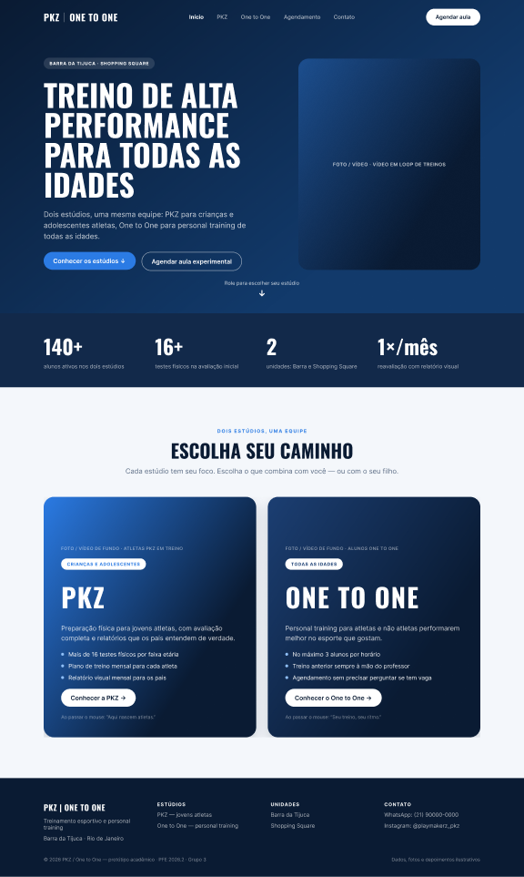
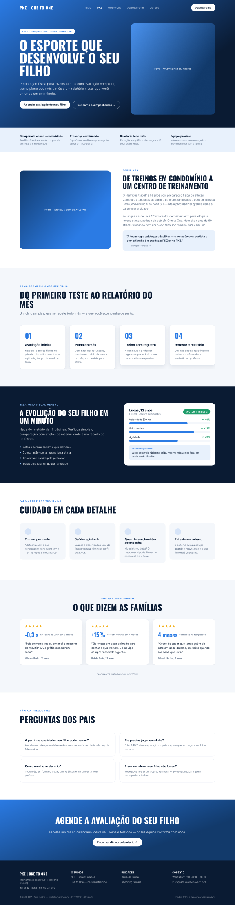
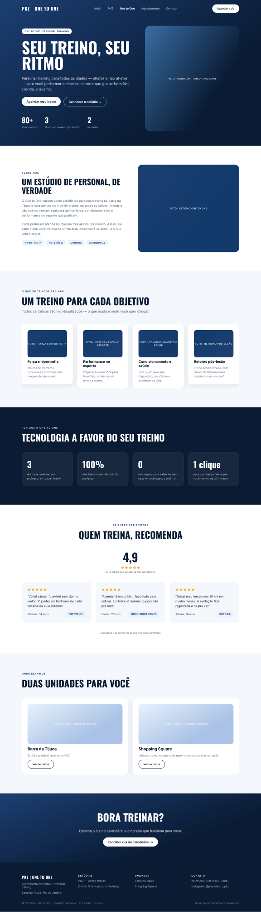
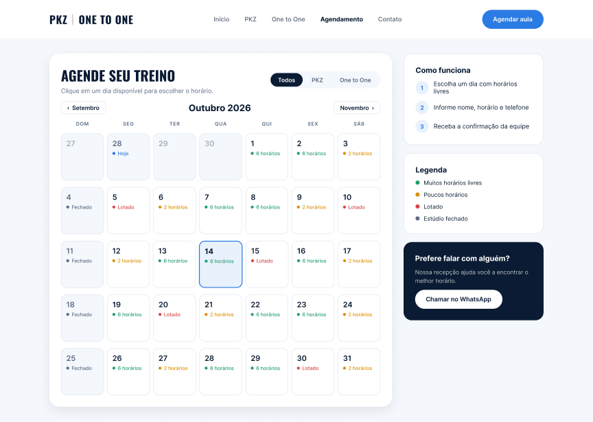
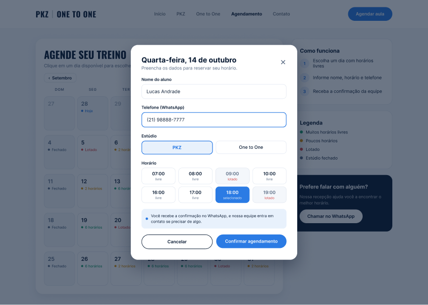
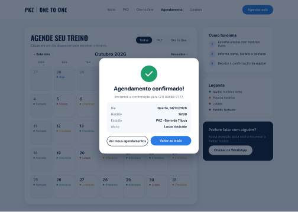
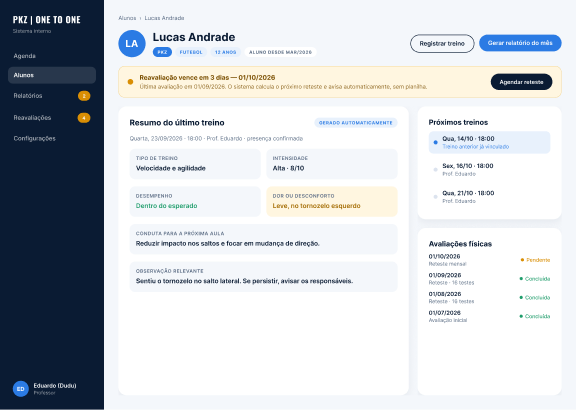
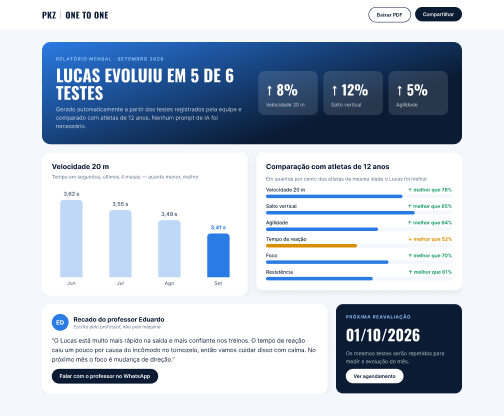

# Protótipo — PKZ / One to One

**Projeto:** PFE 2026.2 — AP1 — Grupo 3
**Cliente:** PKZ / One to One
**Ferramenta:** Figma (protótipo navegável)

- **Arquivo no Figma:** https://www.figma.com/design/CQmuVXYjxTUkLDg5CzWbk0
- **Modo apresentação (clicável):** https://www.figma.com/proto/CQmuVXYjxTUkLDg5CzWbk0

O protótipo tem dois fluxos iniciais: **"Site — PKZ / One to One"** (começa na Home) e **"Sistema interno — professor"** (começa no perfil do aluno).

---

## Decisões de design

- **Paleta:** azul-marinho e branco nas duas marcas. A PKZ usa um azul mais vivo e a One to One um azul mais sóbrio, e a diferença entre as marcas vem do tom do azul, do texto e das fotos (ver brainstorm, Bloco 4).
- **Tipografia:** Oswald (títulos condensados, estilo esportivo) + Inter (textos).
- **PKZ fala com os pais:** como o público é infantil/adolescente, quem decide é o responsável. A página prioriza confiança, clareza sobre o acompanhamento e o relatório mensal.
- **Contato humano:** toda automação mostra também um ponto de contato com a equipe (recado do professor, botão de WhatsApp, confirmação pela equipe), conforme pedido do cliente.
- **Dados fictícios:** nomes, telefones, números e depoimentos são ilustrativos. As áreas "Foto / vídeo" indicam onde entram as imagens reais do cliente.

---

## Telas

### 01 · Home
Abre com uma **hero section** em tela cheia. Ao rolar, aparecem os números das duas marcas e, em seguida, os dois cards lado a lado, onde o usuário **escolhe o caminho: PKZ ou One to One**.

### 02 · Página PKZ
Voltada aos pais de jovens atletas: hero, faixa de confiança, sobre nós, como funciona (avaliação → plano → treino → reteste), prévia do relatório visual, cuidado e segurança, depoimentos de pais com dados, perguntas frequentes e chamada para agendar.

### 03 · Página One to One
Personal training para todas as idades: hero, sobre nós, modalidades, diferenciais, avaliações de clientes, unidades (Barra da Tijuca e Shopping Square) e chamada para agendar.

### 04 · Agendamento — calendário
Calendário mensal com filtro por estúdio e disponibilidade de cada dia (livre, poucos horários, lotado, fechado). Clicar em um dia disponível abre a mini tela.

### 05 · Agendamento — mini tela do dia
Mini tela (modal) com **nome**, **telefone** e **horário**, os campos pedidos pelo cliente. O campo **Estúdio** é sugestão do grupo e ainda precisa ser confirmado com o cliente.

### 06 · Agendamento — confirmado
Resumo do agendamento e aviso de confirmação pelo WhatsApp.

### 07 · Sistema — perfil do aluno
Visão do professor: **resumo automático do último treino** (5W2H, Ação 5), **alerta de reavaliação** (Ação 2), próximos treinos e histórico de avaliações.

### 08 · Relatório visual para os pais
Relatório **gerado automaticamente** a partir dos testes (Ações 3 e 4): resumo do mês, gráfico de evolução, comparação com atletas da mesma idade e recado escrito pelo professor.

---

## Navegação do protótipo

| De | Ação | Para |
|---|---|---|
| Home | "Conhecer os estúdios ↓" | Rola até a escolha de estúdio |
| Home | "Conhecer a PKZ →" / "Conhecer o One to One →" | Página da marca |
| Qualquer página do site | Menu ou "Agendar aula" | Calendário |
| Calendário | Clique em um dia com horários livres | Mini tela do dia |
| Mini tela | "Confirmar agendamento" | Confirmado |
| Mini tela | "Cancelar" ou "×" | Calendário |
| Confirmado | "Voltar ao início" | Home |
| Perfil do aluno | "Gerar relatório do mês" | Relatório para os pais |

---

## Relação com os documentos

| Tela | Brainstorm | 5W2H |
|---|---|---|
| Home, PKZ, One to One | Itens 9 e 10 | Ações 6 e 7 |
| Agendamento (04–06) | Item 13 | Ação 8 |
| Perfil do aluno | Itens 1, 3 e 8 | Ações 1, 2 e 5 |
| Relatório para os pais | Itens 4, 5, 6 e 7 | Ações 3 e 4 |
